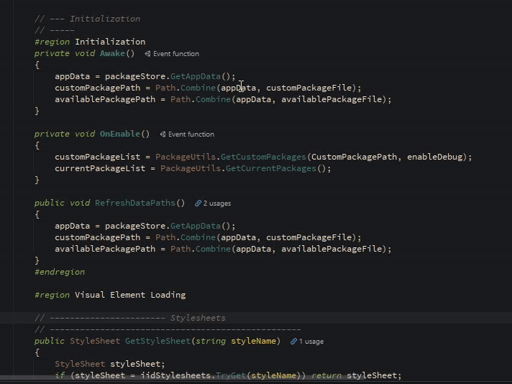

# FormatComments

A simple personal cli tool for formatting my comments strings. Highly unlikely that it will be useful to anyone else.

Just in case, though, once compiled it has 3 positional parameters: file path, line number, and character count (all as string).

Requires: dart2native to build as a desktop executable for whichever platform, should work for any.

### Example 1:

```powershell
.\fcomment.exe "C:\Projects\MyProject\MyCode.cs" "220" "50" 
.\fcomment.exe "C:\Projects\MyProject\MyCode.cs" "221" "50" 
```
Running the above would take the comments below from this:


```c#
// Filename: MyCode.cs
217: } 
218: 
219: // -- Comment
220: // ------- 
221: public void SendNudes()
222: {
```
 To this:
```c#
// Filename: MyCode.cs
217: } 
218: 
219: // -------------------------------------- Comment    <- 50 total characters in length
220: // ----------------------------------------------    <- 50 total characters in length
221: public void SendNudes()
222: {
```

### Example 2:

```powershell
.\fcomment.exe "C:\Projects\MyProject2\MyCode.ps1" "124" "40" 
.\fcomment.exe "C:\Projects\MyProject2\MyCode.ps1" "128" "40" 
```

Running the above would take the comments below from this:

```powershell
# Filename: MyCode.ps1
124: # -- - - Comment1
125: foreach ($projectFolder in $projectLocations) {
126:    $projectFolder = "$projectFolder\${Project}"
127:
128:    # --------- Comment2
129:    if (!$projectFound) {
130:        if (Test-Path "$projectFolder") {
```

To this:

```powershell
# Filename: MyCode.ps1
124: # ----------------------------- Comment1   <- 40 total characters in length
125: foreach ($projectFolder in $projectLocations) {
126:    $projectFolder = "$projectFolder\${Project}"
127:
128:    # -------------------------- Comment2   <- 40 total characters in length
129:    if (!$projectFound) {
130:        if (Test-Path "$projectFolder") {
```

It seems like it would not be worth it, but in Rider I have it setup as an external tool with keybindings for various lengths.  

Below, I just put my cursor on the correct line, then press Ctrl + Alt + 7, then 5, to designate a character length of 75.  
If I wanted a character length of 50, you guessed it, Ctrl + Alt + 5, then 0. Boom. 



## Contributing

Pull requests are welcome. For major changes, please open an issue first to discuss what you would like to change.  

## License

[MIT](https://choosealicense.com/licenses/mit/)

---

